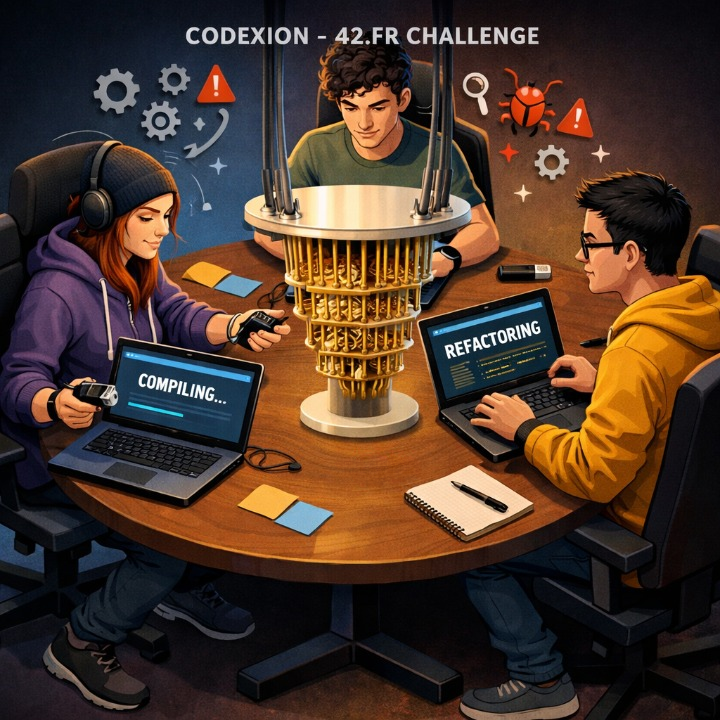

*This project has been created as part of the 42 curriculum by obachuri.*

---

# Codexion - Master the race for resources


This project is part of the 42.fr curriculum.

---
This is a variation of the classic Dining Philosophers problem.

**The task**

Race against time in this thrilling concurrency challenge! Orchestrate
multiple coders competing for limited USB dongles using POSIX threads, mutexes, and
smart scheduling—master resource synchronization before burnout strikes.

One or more *coders* sit in a circular way around one table.
Coder routine contains:
- compile (two dongles are needed),
- debug,
- refactor.

For *compiling* coder use two USB *dongles* and there are as many dongles as coders. 
Between every two coders is one dongle and to compile coder must take left and right dongles.

After compiling coder frees dongles and starts debugging. 
Once debugging is done, they start refactoring.
After completing the refactoring phase, the coder will immediately attempt to
acquire dongles and start compiling again.

*Dongle cooldown* - After a coder releases a dongle, the dongle cannot be taken again until *dongle_cooldown* milliseconds have elapsed.

*Burn out* - Every coder needs to compile regularly and should never *burn out*. Coders burn out if can`t compile in given time.

*Scheduler* - If two coders try to use one Dongle simultaneously, there are two strategies who must be prioritized:
- *fifo* - *First In, First Out*: the dongle is granted to the coder whose request arrived first. 
- *edf* - Earliest Deadline First: the dongle is granted to the coder who could *burn out* earlier.

Coders do not communicate with each other.

Information of any state change of a coder must be formatted and printed.
A displayed state message should not be mixed up with another message.
A message announcing that a coder burned out should be displayed no more than 10 ms after the actual burnout.



Key techniques demonstrated:
- Multi-threaded synchronization using POSIX threads, mutex lock, mutex condition variable
- Min-heap priority queue
- FIFO and EDF scheduling 

## Compile

```bash
make all
```

## Usage

```bash
# Run with parameters
.\codexion <number_of_coders> <time_to_burnout> <time_to_compile> <time_to_debug> <time_to_refactor> <number_of_compiles_required> <dongle_cooldown> <scheduler>
```
Parameters (all mandatory):
- number_of_coders: Number of concurrent coders(threads)
- time_to_burnout: Max time in milliseconds after start simulation or the last compile before the coder burn out
- time_to_compile: Time in ms to compile code
- time_to_debug: Time in ms to debug code
- time_to_refactor: Time in ms to refactor code
- number_of_compiles_required: The task - number of times each coder must compile successfully 
- dongle_cooldown: Dongle cooldown period in ms after release 
- scheduler: Scheduler policy: fifo or edf

```bash
# example
./codexion 4 301 100 100 100 3 10 edf
```

### Output Format
```bash
<timestamp_ms> <coder_id> has taken a dongle
<timestamp_ms> <coder_id> has taken a dongle
<timestamp_ms> <coder_id> is compiling
<timestamp_ms> <coder_id> is debugging
<timestamp_ms> <coder_id> is refactoring
<timestamp_ms> <coder_id> burned out
```

## Blocking cases handled

### Deadlock Prevention (Coffman's Four Conditions)

There are four necessary and sufficient conditions for deadlock (Coffman's Four Conditions):
- *Mutual Exclusion* - True - Unavoidable in this project. The dongles are shared resources there. One dongle could be used by two coders but not simultaneously.
- *No preemption* - True - Coders voluntarily release dongles.
- *Circular Wait* - False - If a coder took one dongle but couldn't take the second he release the first dongle and tries to take the second.
- *Hold and Wait* - False - The same as for *Circular Wait*. Coder doesn`t Hold the first dongle if couldn't take the second.

### Starvation Prevention

- At the beginning, Even coders (coder_id % 2 == 0) wait *time_to_compile* before start training to take a dongle
- If two coders trying to take one dongle, the decision on who to prioritize is made based on the selected scheduler (fifo or edf).

### Data Races

All shared resurses is protected by Mutex:
- Dongle
- Coder
- Logging
- Counter of Coders who completed the task 
- Simulation end flag

### Cooldown handling

The dongle cooldown controled based on 'dongle->end_of_last_use' property.
It's set when dongle releasing in function "return_dongle_after_compile()" and checked in check_dongle_cooldown() when someone try to take the dongle. 

### Log serialization

In multi-threaded or distributed systems, multiple parts of a program try to write logs at the same time. Without serialization, you can get:
- Jumbled log lines (messages overlapping each other)
- Out-of-order events (hard to debug)
- Corrupted output (especially in files or streams)

To solve the issue one of these approaches is required:
- Single-threaded logging - Only one thread writes logs.
- Locking / synchronization - Threads must acquire a lock before writing to the log.
- Queue-based logging - Threads push messages into a queue, and a single worker writes them in order.

This project implements logging based on a heap-based minimum priority queue.
- Log Events is putted in the queue with time as key.
- Once per millisecond the queue is checked and events that occurred 5 or more millisecond ago are printed in correct order.
- The log queue insert() and pop() is protected by Mutex.

#### Min Heap Priority Queue on Binary Heap Structure

The project implements a custom Min Heap Priority Queue to ensure ordered and deterministic processing of events (primarily for logging). The structure is based on a binary heap, providing efficient insertion and extraction of the smallest element.

That part could be used as library in another projects.

Binary Heap Operations:
- Insert      O(log n)
- ExtractMin  O(log n)
- PeekMin     O(1)

##### Data Structure Overview

The priority queue is defined as:
``` C
// minpqueue.h
typedef struct s_qelement
{
	long            sort;
	unsigned int    id;
	void            *data;
} t_qelement;

typedef struct s_pqueue
{
	unsigned long   capacity;
	unsigned long   len;
	unsigned long   id;
	t_qelement      *qe;
} t_pqueue;

t_pqueue	*pq_init(void);
void	pq_clean(t_pqueue **q_);
int 	pq_insert(t_pqueue *q, long sort, void *data);

void	*pq_peek(t_pqueue *q);	// return pointer to data
void	*pq_pop(t_pqueue *q);	// return pointer to data
```
- sort → Primary key (e.g., timestamp of event)
- id → Secondary key to preserve insertion order (FIFO for equal priority)
- data → Pointer to stored element (e.g., log event)

👉 The id field is critical: it guarantees stable ordering, meaning two events with the same timestamp are processed in the order they were inserted.

##### Heap Properties

The structure maintains the Min Heap property:
- The parent node is always less than or equal to its children.

This ensures:
- The smallest element is always at the root (index 0)
- Fast access to the next event to process

#####  Memory Management

Queue is initialized with a fixed capacity (PQ_INIT_SIZE)

Each inserted element stores a pointer (void *data)

pq_clean:
- Frees all stored data
- Frees the heap itself

⚠️ Important:
- The queue owns the memory of stored elements, so inserted data must be dynamically allocated.

##### Why a Min Heap?

The Min Heap is ideal for this project because:

- Logging requires chronological ordering
- Events may arrive slightly out of order due to thread scheduling
- Efficient reordering is required in real time

Compared to alternatives:
- Linked list → O(n) insertion
- Sorted array → expensive shifts

Min heap → optimal balance: O(log n)

## Thread Synchronization Mechanisms

This project relies on POSIX threading primitives to ensure safe and deterministic interaction between concurrent coder threads and shared resources such as dongles, logging infrastructure, and global simulation state.

### Mutexes
Mutexes are the primary mechanism used to protect shared data from concurrent access (data races).

They are used in:

Dongles (t_dongle.mutex)
Protects access to:
- is_used_now
- coder_id_use_now
- end_of_last_use
- internal request queue

Global state (t_param)
- print_mutex → ensures log messages are not interleaved
- it_is_the_end_mutex → protects simulation termination flag
- coders_complete_task_mutex → protects completion counter

Coder (t_coder.mutex)
- Protects per-thread state such as last_compile

### Summary

The synchronization design combines:

- Mutexes → safety (mutual exclusion)
- Condition variables → efficiency (blocking + signaling)
- Custom scheduling queue → fairness (FIFO / EDF)
- Monitor thread → correctness (burnout detection)

Together, these mechanisms provide a robust solution to concurrency challenges such as race conditions, starvation, and coordination between independent threads.

## Resources & References

Deadlock and Coffman's Four Conditions
https://en.wikipedia.org/wiki/Deadlock_%28computer_science%29

GeeksforGeeks — Binary Heap
https://www.geeksforgeeks.org/binary-heap/

Priority Queue using Heap
https://www.geeksforgeeks.org/priority-queue-using-binary-heap/

[pthread_mutex_init(3)](https://man7.org/linux/man-pages/man3/pthread_mutex_init.3.html)
[pthread_cond_wait(3)](https://man7.org/linux/man-pages/man3/pthread_cond_wait.3p.html)
[pthread_cond_broadcast(3)](https://man7.org/linux/man-pages/man3/pthread_cond_broadcast.3p.html)
[gettimeofday(2)](https://man7.org/linux/man-pages/man2/gettimeofday.2.html)

### AI Usage
Tools Used: ChatGPT (GPT-4)

AI was used to generate the illustration and Structuring this README to meet subject requirements. 

## License

Part of the 42 curriculum project.
